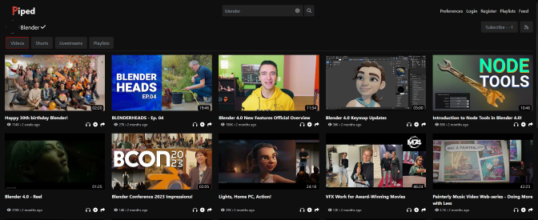

<!--
N.B.: Aquest README ha estat generat automàticament per <https://github.com/YunoHost/apps/tree/master/tools/readme_generator>
NO s'ha de modificar manualment.
-->

# Piped per YunoHost

[](https://ci-apps.yunohost.org/ci/apps/piped/)


[](https://install-app.yunohost.org/?app=piped)

*[Llegeix aquest README en altres idiomes.](./ALL_README.md)*

> *Aquest paquet et permet instal·lar Piped de forma ràpida i senzilla en un servidor YunoHost.*  
> *Si no tens YunoHost, consulta [la guia](https://yunohost.org/install) per saber com instal·lar-lo.*

## Visió general

# The Problem

YouTube has an extremely invasive privacy policy which relies on using user data in unethical ways. You give them a lot of data - ranging from ideas, music taste, content, political opinions, and much more than you think.

By using Piped, you can freely watch and listen to content without the fear of prying eyes watching everything you are doing.

## Features:

**User Features**

-   [x] No Ads
-   [x] No Tracking
-   [x] Lightweight on server and client
-   [x] Infinite Scrolling
-   [x] Light/Dark themes
-   [x] Login
-   [x] Feeds
-   [x] Playlists
-   [x] Integration with [SponsorBlock](https://github.com/ajayyy/SponsorBlock)
-   [x] Integration with [LBRY](https://lbry.com/) for streaming
-   [x] Integration with [Return YouTube Dislike](https://returnyoutubedislike.com/) via [RYD-Proxy](https://github.com/TeamPiped/RYD-Proxy)
-   [x] 4K support
-   [x] No connections to Google's servers
-   [x] Playing just audio
-   [x] PWA support
-   [x] Locally saved Preferences
-   [x] [Available in many languages](src/locales), thanks to [our translators](https://hosted.weblate.org/projects/piped/frontend/)
-   [x] Embedded video support
-   [x] No age restriction
-   [x] Bypasses Geo restrictions if possible through a federated network

**Technical Features**

-   [x] Multi-region load-balancing
-   [x] Performant by design, designed to handle 1000s of users concurrently
-   [x] Does not use official YouTube APIs
-   [x] Uses [NewPipeExtractor](https://github.com/TeamNewPipe/NewPipeExtractor) to extract information
-   [x] Public [JSON API](https://docs.piped.video/docs/api-documentation/)
-   [x] Federated protocol on Matrix to let instances collaborate with each other

**Versió inclosa:** 2025.03.30~ynh1

**Demo:** <https://piped.video/>

## Captures de pantalla




## :red_circle: Anticaracterístiques

- **Non-free Network Services**: Promotes or depends entirely on a non-free network service.

## Documentació i recursos

- Lloc web oficial de l'aplicació: <https://docs.piped.video/>
- Documentació oficial per l'administrador: <https://docs.piped.video/docs/>
- Repositori oficial del codi de l'aplicació: <https://github.com/TeamPiped/Piped>
- Botiga YunoHost: <https://apps.yunohost.org/app/piped>
- Reportar un error: <https://github.com/YunoHost-Apps/piped_ynh/issues>

## Informació per a desenvolupadors

Envieu les pull request a la [branca `testing`](https://github.com/YunoHost-Apps/piped_ynh/tree/testing).

Per provar la branca `testing`, procedir com descrit a continuació:

```bash
sudo yunohost app install https://github.com/YunoHost-Apps/piped_ynh/tree/testing --debug
o
sudo yunohost app upgrade piped -u https://github.com/YunoHost-Apps/piped_ynh/tree/testing --debug
```

**Més informació sobre l'empaquetatge d'aplicacions:** <https://yunohost.org/packaging_apps>
