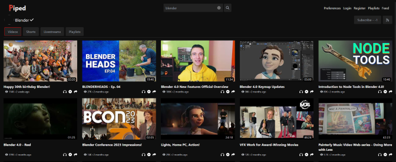
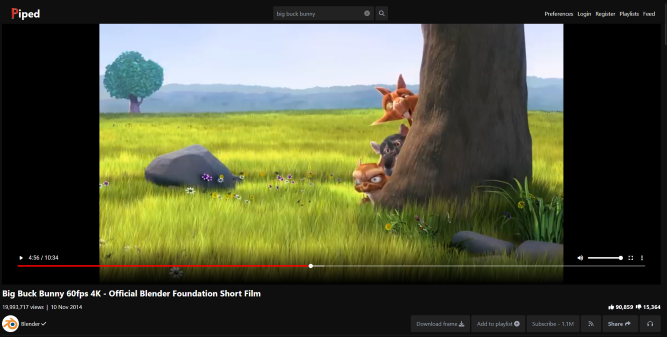

<!--
Este archivo README esta generado automaticamente<https://github.com/YunoHost/apps/tree/master/tools/readme_generator>
No se debe editar a mano.
-->

# Piped para Yunohost

[](https://ci-apps.yunohost.org/ci/apps/piped/)  

[](https://install-app.yunohost.org/?app=piped)

*[Leer este README en otros idiomas.](./ALL_README.md)*

> *Este paquete le permite instalarPiped rapidamente y simplement en un servidor YunoHost.*  
> *Si no tiene YunoHost, visita [the guide](https://yunohost.org/install) para aprender como instalarla.*

## Descripción general

# The Problem

YouTube has an extremely invasive privacy policy which relies on using user data in unethical ways. You give them a lot of data - ranging from ideas, music taste, content, political opinions, and much more than you think.

By using Piped, you can freely watch and listen to content without the fear of prying eyes watching everything you are doing.

## Features:

**User Features**

-   [x] No Ads
-   [x] No Tracking
-   [x] Lightweight on server and client
-   [x] Infinite Scrolling
-   [x] Light/Dark themes
-   [x] Login
-   [x] Feeds
-   [x] Playlists
-   [x] Integration with [SponsorBlock](https://github.com/ajayyy/SponsorBlock)
-   [x] Integration with [LBRY](https://lbry.com/) for streaming
-   [x] Integration with [Return YouTube Dislike](https://returnyoutubedislike.com/) via [RYD-Proxy](https://github.com/TeamPiped/RYD-Proxy)
-   [x] 4K support
-   [x] No connections to Google's servers
-   [x] Playing just audio
-   [x] PWA support
-   [x] Locally saved Preferences
-   [x] [Available in many languages](src/locales), thanks to [our translators](https://hosted.weblate.org/projects/piped/frontend/)
-   [x] Embedded video support
-   [x] No age restriction
-   [x] Bypasses Geo restrictions if possible through a federated network

**Technical Features**

-   [x] Multi-region load-balancing
-   [x] Performant by design, designed to handle 1000s of users concurrently
-   [x] Does not use official YouTube APIs
-   [x] Uses [NewPipeExtractor](https://github.com/TeamNewPipe/NewPipeExtractor) to extract information
-   [x] Public [JSON API](https://docs.piped.video/docs/api-documentation/)
-   [x] Federated protocol on Matrix to let instances collaborate with each other

**Versión actual:** 2024.07.03~ynh1

**Demo:** <https://piped.video/>

## Capturas




## :red_circle: Características no deseables

- **Non-free Network Services**: Promotes or depends entirely on a non-free network service.

## Documentaciones y recursos

- Sitio web oficial: <https://docs.piped.video/>
- Documentación administrador oficial: <https://docs.piped.video/docs/>
- Repositorio del código fuente oficial de la aplicación : <https://github.com/TeamPiped/Piped>
- Catálogo YunoHost: <https://apps.yunohost.org/app/piped>
- Reportar un error: <https://github.com/YunoHost-Apps/piped_ynh/issues>

## Información para desarrolladores

Por favor enviar sus correcciones a la [`branch testing`](https://github.com/YunoHost-Apps/piped_ynh/tree/testing

Para probar la rama `testing`, sigue asÍ:

```bash
sudo yunohost app install https://github.com/YunoHost-Apps/piped_ynh/tree/testing --debug
o
sudo yunohost app upgrade piped -u https://github.com/YunoHost-Apps/piped_ynh/tree/testing --debug
```

**Mas informaciones sobre el empaquetado de aplicaciones:** <https://yunohost.org/packaging_apps>
