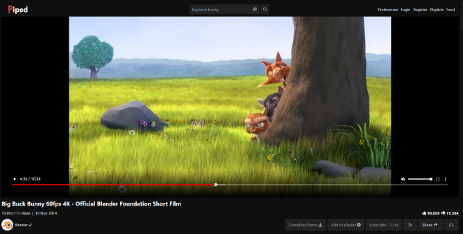

<!--
N.B.: Questo README è stato automaticamente generato da <https://github.com/YunoHost/apps/tree/master/tools/readme_generator>
NON DEVE essere modificato manualmente.
-->

# Piped per YunoHost

[](https://dash.yunohost.org/appci/app/piped)  

[](https://install-app.yunohost.org/?app=piped)

*[Leggi questo README in altre lingue.](./ALL_README.md)*

> *Questo pacchetto ti permette di installare Piped su un server YunoHost in modo semplice e veloce.*  
> *Se non hai YunoHost, consulta [la guida](https://yunohost.org/install) per imparare a installarlo.*

## Panoramica

# The Problem

YouTube has an extremely invasive privacy policy which relies on using user data in unethical ways. You give them a lot of data - ranging from ideas, music taste, content, political opinions, and much more than you think.

By using Piped, you can freely watch and listen to content without the fear of prying eyes watching everything you are doing.

## Features:

**User Features**

-   [x] No Ads
-   [x] No Tracking
-   [x] Lightweight on server and client
-   [x] Infinite Scrolling
-   [x] Light/Dark themes
-   [x] Login
-   [x] Feeds
-   [x] Playlists
-   [x] Integration with [SponsorBlock](https://github.com/ajayyy/SponsorBlock)
-   [x] Integration with [LBRY](https://lbry.com/) for streaming
-   [x] Integration with [Return YouTube Dislike](https://returnyoutubedislike.com/) via [RYD-Proxy](https://github.com/TeamPiped/RYD-Proxy)
-   [x] 4K support
-   [x] No connections to Google's servers
-   [x] Playing just audio
-   [x] PWA support
-   [x] Locally saved Preferences
-   [x] [Available in many languages](src/locales), thanks to [our translators](https://hosted.weblate.org/projects/piped/frontend/)
-   [x] Embedded video support
-   [x] No age restriction
-   [x] Bypasses Geo restrictions if possible through a federated network

**Technical Features**

-   [x] Multi-region load-balancing
-   [x] Performant by design, designed to handle 1000s of users concurrently
-   [x] Does not use official YouTube APIs
-   [x] Uses [NewPipeExtractor](https://github.com/TeamNewPipe/NewPipeExtractor) to extract information
-   [x] Public [JSON API](https://docs.piped.video/docs/api-documentation/)
-   [x] Federated protocol on Matrix to let instances collaborate with each other

**Versione pubblicata:** 2024.03.28~ynh1

**Prova:** <https://piped.video/>

## Screenshot




## :red_circle: Anti-funzionalità

- **Servizi di rete non liberi**: Promuove o dipende interamente da servizi di rete non liberi.

## Documentazione e risorse

- Sito web ufficiale dell’app: <https://docs.piped.video/>
- Documentazione ufficiale per gli amministratori: <https://docs.piped.video/docs/>
- Repository upstream del codice dell’app: <https://github.com/TeamPiped/Piped>
- Store di YunoHost: <https://apps.yunohost.org/app/piped>
- Segnala un problema: <https://github.com/YunoHost-Apps/piped_ynh/issues>

## Informazioni per sviluppatori

Si prega di inviare la tua pull request alla [branch di `testing`](https://github.com/YunoHost-Apps/piped_ynh/tree/testing).

Per provare la branch di `testing`, si prega di procedere in questo modo:

```bash
sudo yunohost app install https://github.com/YunoHost-Apps/piped_ynh/tree/testing --debug
o
sudo yunohost app upgrade piped -u https://github.com/YunoHost-Apps/piped_ynh/tree/testing --debug
```

**Maggiori informazioni riguardo il pacchetto di quest’app:** <https://yunohost.org/packaging_apps>
